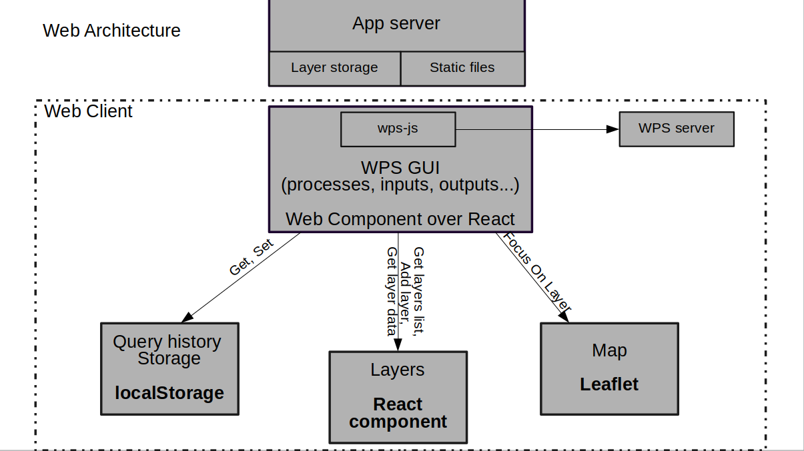

# Goal 

This project goal is to provide a dynamic, cross-platform, good-looking & maintainable client side for WPS

The palatforms we are aiming for are:

* Web
* ArcMap
* QGIS

# Archtecture

Over the desktop applications (ArcMap, QGIS) the view and WPS client will be using embed web view and native connectors to the host app

Architecture: 

Web Architecture: 

Desktop Architecture: 

